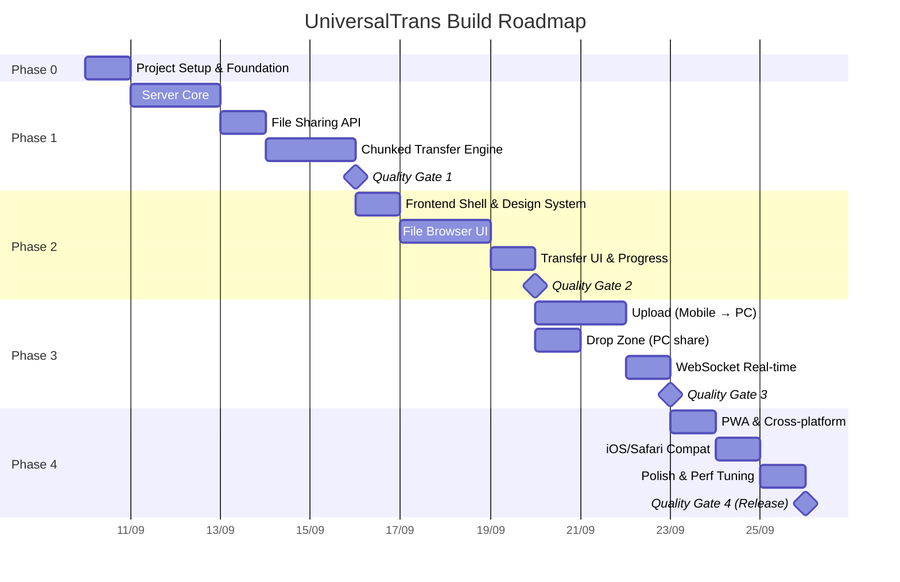

# UniversalTrans — Build Roadmap

> Production-grade development plan with milestones, checkpoints, and quality gates.

---

## Timeline Overview



---

## Phase 0: Project Setup & Foundation

### Mục tiêu
Thiết lập project structure, tooling, và dependencies. Đảm bảo mọi thứ chạy được từ đầu.

### Tasks

#### 0.1 — Project Initialization
- [ ] `npm init` với metadata chuẩn
- [ ] Cấu hình `package.json`: type "module", scripts, engines
- [ ] Install production dependencies
- [ ] Install dev dependencies (eslint, prettier, supertest)
- [ ] Cấu hình ESLint (flat config, ES2022+)
- [ ] Cấu hình Prettier
- [ ] Tạo `.gitignore`

#### 0.2 — Project Structure
- [ ] Tạo cấu trúc thư mục theo `.agents/rules/coding-standards.md`
- [ ] Tạo placeholder files với JSDoc header
- [ ] Tạo `README.md` với getting started

#### 0.3 — Config System
- [ ] Implement `src/config.js`:
  - Load từ environment variables
  - Default values theo `TECHNICAL_SPEC.md`
  - Cross-platform path resolution (Windows vs Linux)
  - Validation: port range, directory existence, etc.
- [ ] Unit tests cho config loading & validation

#### 0.4 — Utility Foundation
- [ ] Implement `src/utils/network.js`: `getLanIp()`
- [ ] Implement `src/utils/file-utils.js`: `formatFileSize()`, `getFileType()`, `sanitizeFileName()`
- [ ] Implement `src/utils/id-generator.js`: nanoid wrapper
- [ ] Unit tests cho tất cả utilities (target: 95% coverage)

### Quality Gate 0 ✅
```bash
# Tất cả phải pass:
npm test                    # Unit tests pass
npx eslint src/             # Zero lint errors
node src/config.js          # Config loads without error
```

---

## Phase 1: Server Core

### Mục tiêu
Express server hoạt động, serve static files, REST API cơ bản, download/upload hoạt động.

### Tasks

#### 1.1 — Express Server Setup
- [ ] Implement `src/server.js`:
  - Express app creation (factory function cho testability)
  - Static file serving (`public/`)
  - JSON body parsing + multer cho share/upload
  - CORS middleware (LAN only, allow localhost test)
  - Request logging middleware (không log full path/PIN)
  - Error handling middleware (`AppError` chuẩn)
  - Graceful shutdown (SIGINT, SIGTERM, clear staging + temp)
  - Tắt compression cho file transfer
- [ ] Server binds LAN IP, allow `127.0.0.1` test, cấm `0.0.0.0` prod
- [ ] Auto-open browser on start + QR (kèm PIN nếu bật)
- [ ] Integration test: server starts and responds to `/api/info`

#### 1.2 — Share Manager Service
- [ ] Implement `src/services/share-manager.js`:
  - In-memory staging area (Map<fileId, FileMetadata>)
  - `addFile(absolutePath)` → validate path, generate ID, return metadata
  - `addFiles(paths[])` → batch add
  - `removeFile(fileId)` → remove from staging
  - `getFile(fileId)` → return metadata + absolute path
  - `listFiles()` → return all staged files
  - `clear()` → clear staging
  - Path validation: resolve symlinks, check existence, prevent traversal
- [ ] Unit tests (target: 90% coverage)

#### 1.3 — File Sharing API
- [ ] Implement `src/routes/files.js`:
  - `GET /api/shared` → list staged files
  - `POST /api/share` → dual mode: multipart (browser) + JSON paths (CLI/Electron local only)
  - `DELETE /api/share/:fileId` → remove from staging
- [ ] Implement `src/routes/info.js`:
  - `GET /api/info` → server name, IP, port, QR code, version
- [ ] Implement `POST /api/auth` stub (PIN null → bypass, PIN set → enforce Phase 2)
- [ ] Integration tests cho tất cả endpoints
- [ ] Security tests cho path traversal (encode, null byte, `..`, backslash, symlink)

#### 1.4 — Download (Streaming)
- [ ] Implement download trong `src/routes/transfer.js`:
  - `GET /api/download/:fileId` → stream file
  - Range header support cho resume
  - Correct `Content-Type`, `Content-Disposition`, `Content-Length` headers
  - `Accept-Ranges: bytes` header
  - 206 Partial Content cho range requests
- [ ] Test: download 100MB file, verify integrity (checksum)
- [ ] Test: resume download (Range header)

#### 1.5 — Chunked Upload Engine
- [ ] Implement `src/services/chunked-upload.js`:
  - `initUpload(fileName, fileSize, mimeType)` → uploadId, chunkSize, totalChunks
  - `addChunk(uploadId, chunkIndex, chunkBuffer)` → save to temp
  - `getStatus(uploadId)` → received chunks, missing chunks
  - `complete(uploadId)` → merge chunks, move to uploadDir
  - `cleanup()` → remove expired uploads
  - Chunk temp directory management
  - Concurrent chunk safety (no race conditions)
- [ ] Implement chunked upload routes:
  - `POST /api/upload/init`
  - `POST /api/upload/chunk`
  - `GET /api/upload/status/:uploadId`
  - `POST /api/upload/complete`
- [ ] Implement simple upload route:
  - `POST /api/upload` (files < 100MB, multer)
- [ ] Unit tests cho chunked-upload service
- [ ] Integration test: full upload cycle (init → chunks → complete)
- [ ] Integration test: resume after interruption

#### 1.6 — Thumbnail Service
- [ ] Implement `src/services/thumbnail.js`:
  - Generate WebP thumbnails ảnh (200x200, quality 80%), lazy + cache
  - Video/file >100MB → icon placeholder, không ffmpeg MVP
  - Handle missing sharp gracefully (fallback to no thumbnails)
- [ ] Route: `GET /api/thumbnail/:fileId`
- [ ] Unit tests

### 🚧 Quality Gate 1
```bash
# Tất cả phải pass:
npm test                              # All unit tests
npm run test:integration              # All API tests
npm run test:coverage                 # >80% overall, >90% critical

# Manual:
curl http://<ip>:3456/api/info        # Returns valid response
curl http://<ip>:3456/api/shared      # Returns empty list
# Upload + download a 100MB test file via curl → verify integrity
```

**Checkpoint criteria:**
- [ ] All REST endpoints functional (khớp TECHNICAL_SPEC §3)
- [ ] File download streaming verified (100MB+, Range 206, checksum)
- [ ] Chunked upload + resume verified
- [ ] Path traversal attacks blocked (security tests pass)
- [ ] Server RAM < 256MB logic trong transfer 100MB+, max 5 concurrent

---

## Phase 2: Frontend Shell & File Browser

### Mục tiêu
Professional-grade UI shell, design system, file browsing experience.

### Tasks

#### 2.1 — Design System (CSS)
- [ ] Implement `public/css/variables.css`:
  - Color palette (dark theme primary)
  - Typography scale (Inter font)
  - Spacing scale (4px base)
  - Border radii, shadows, blur values
  - Transition curves and durations
  - Z-index scale
  - Breakpoints (mobile: 0, tablet: 768px, desktop: 1024px)
- [ ] Implement `public/css/base.css`:
  - CSS reset / normalize
  - Typography (headings, body, mono)
  - Global element styles
  - Scrollbar styling
  - Selection highlight
- [ ] Implement `public/css/animations.css`:
  - Fade in/out
  - Slide in (up, down, left, right)
  - Scale pulse
  - Shimmer (for loading states)
  - Progress bar gradient animation
  - Drop zone pulse border

#### 2.2 — App Shell
- [ ] Implement `public/index.html`:
  - Semantic HTML5 structure
  - PWA meta tags (viewport, theme-color, apple-mobile-web-app)
  - Loading state (skeleton screen)
  - Layout: header, main content, bottom bar (mobile) / sidebar (desktop)
- [ ] Implement `public/css/layout.css`:
  - Header bar (server info, device count, QR button)
  - Mobile: bottom navigation bar
  - Desktop: sidebar navigation
  - Main content area with scroll
  - Modal overlay system
  - Toast notification system
- [ ] Implement `public/js/app.js`:
  - Module initialization
  - Router (hash-based: #files, #upload, #transfers, #devices)
  - Global state management
  - Error boundary (catch + display unhandled errors)

#### 2.3 — Connection Manager
- [ ] Implement `public/js/connection.js`:
  - WebSocket connection with auto-reconnect
  - Exponential backoff (1s, 2s, 4s, 8s, max 30s)
  - Connection state UI (connected/reconnecting/disconnected)
  - Event dispatch to other modules
  - Heartbeat ping (30s interval)

#### 2.4 — File Browser UI
- [ ] Implement `public/js/file-browser.js`:
  - Fetch shared files from `GET /api/shared`
  - Grid view (cards with thumbnails)
  - List view (compact table)
  - Toggle grid/list view
  - File type icons/badges
  - File size, date display
  - Lazy thumbnail loading (IntersectionObserver)
  - Empty state design
  - Loading skeleton
- [ ] Implement `public/css/components.css`:
  - File card component (glassmorphism)
  - File list row component
  - Badge component (file type)
  - Button variants (primary, secondary, icon-only)
  - Toggle switch
  - Tooltip
  - Empty state illustration

#### 2.5 — UI Utilities
- [ ] Implement `public/js/ui.js`:
  - `createElement()` helper (safe DOM creation)
  - Toast notification system
  - Modal dialog system
  - Confirm dialog
  - Loading spinner
  - Format utilities (size, date, duration)

### 🚧 Quality Gate 2
```bash
# Manual verification:
# 1. Start server: npm run dev
# 2. Open in desktop browser → verify layout, design, responsiveness
# 3. Open in Chrome DevTools mobile mode → verify mobile layout
# 4. Navigate between views (files, upload, transfers, devices)
# 5. Verify file browser shows shared files with correct metadata
# 6. Verify thumbnails load lazily
# 7. Verify WebSocket connection indicator works
# 8. Verify responsive: resize browser window smoothly
```

**Checkpoint criteria:**
- [ ] Design looks premium (dark theme, glassmorphism, animations)
- [ ] Responsive works: mobile ↔ tablet ↔ desktop
- [ ] File browser shows shared files with thumbnails
- [ ] WebSocket connected indicator functional
- [ ] No JS errors in console
- [ ] Lighthouse Performance score > 90

---

## Phase 3: Transfer UI & Upload

### Mục tiêu
Complete bidirectional transfer: mobile upload + PC drag-and-drop share + real-time progress.

### Tasks

#### 3.1 — Upload from Mobile
- [ ] Implement upload UI in `public/js/file-browser.js` (or dedicated upload view):
  - Upload button → `<input type="file" multiple>`
  - File type filter: images, videos, APK, all
  - Camera capture option (`capture="environment"`)
  - Preview selected files before upload
  - Upload confirmation with file list
- [ ] Implement `public/js/transfer.js`:
  - Small file upload (< 100MB): single POST
  - Large file upload (≥ 100MB): chunked upload protocol
  - Per-file progress tracking
  - Overall batch progress
  - Speed calculation (rolling average, last 5 seconds)
  - ETA calculation
  - Pause / Resume / Cancel per transfer
  - Queue management: max 3 concurrent uploads
  - Auto-retry on failure (3 attempts, exponential backoff)
  - Resume after reconnection (fetch upload status, continue from last chunk)

#### 3.2 — Drop Zone (PC shares files)
- [ ] Implement `public/js/drop-zone.js`:
  - Drag & drop area on PC browser
  - Visual feedback: border highlight, file count preview
  - Handle `dragenter`, `dragover`, `dragleave`, `drop` events
  - Read dropped files/folders (`DataTransfer.items`, `webkitGetAsEntry()`)
  - Folder recursive traversal (fallback picker nếu thiếu webkitdirectory)
  - POST multipart tới `/api/share` (upload content → staging). JSON paths chỉ CLI/Electron
  - Paste support: `Ctrl+V` to paste images from clipboard
  - Remove file from sharing via `DELETE /api/share/:fileId`

#### 3.3 — Transfer Progress UI
- [ ] Implement transfer progress components:
  - Transfer card: file name, progress bar, speed, ETA, cancel button
  - Active transfers list
  - Completed transfers list (with re-download link)
  - Failed transfers list (with retry button)
  - Overall progress summary bar
  - Animated gradient progress bar
  - Speed graph (optional, Phase 2)

#### 3.4 — WebSocket Integration
- [ ] Server-side: implement WebSocket handlers in `src/websocket/`:
  - `device:join` / `device:leave` broadcasting
  - `share:update` when staging changes
  - `transfer:progress` chỉ upload; download client tự tính
  - `transfer:complete` / `transfer:error` notifications
  - Client registration (`client:register`)
  - Heartbeat (`client:ping` 30s / `server:pong`, timeout 90s)
- [ ] Client-side: wire WebSocket events to UI:
  - Update file list on `share:update`
  - Show toast on `device:join` / `device:leave`
  - Update progress bars on `transfer:progress`
  - Show completion toast on `transfer:complete`

#### 3.5 — Device List
- [ ] Implement device tracking:
  - Server: track connected devices (WebSocket clients)
  - Client: `#devices` view showing online devices
  - Device card: name, platform icon, IP, connection duration
  - Connection/disconnection animations

### 🚧 Quality Gate 3
```bash
# Full functional test:
# 1. Start server on Windows PC
# 2. Open on Android Chrome → upload photo → verify on PC
# 3. Drag file into PC browser → verify on Android file list
# 4. Download file on Android → verify content
# 5. Upload 500MB video from Android → verify progress bar + speed
# 6. Kill WiFi during upload → reconnect → verify resume works
# 7. Open on 2 devices simultaneously → verify both see updates
```

**Checkpoint criteria:**
- [ ] Upload from mobile works (all file types)
- [ ] Drag-and-drop share on PC works
- [ ] Progress bars accurate (±5%)
- [ ] Speed display accurate (±10%)
- [ ] Resume after disconnect works
- [ ] Multiple devices can connect simultaneously
- [ ] WebSocket events update UI in real-time
- [ ] No memory leaks (check browser DevTools Memory tab)

---

## Phase 4: PWA & Cross-Platform Polish

### Mục tiêu
Installable PWA, iOS/Safari compatibility, performance tuning, production readiness.

### Tasks

#### 4.1 — PWA Setup
- [ ] Implement `public/manifest.json`:
  - App name, short name, description
  - Icons (192x192, 512x512, maskable + favicon)
  - Theme color, background color
  - Display: standalone
  - Start URL
- [ ] Generate app icons (design + multiple sizes)
- [ ] Implement `public/sw.js`:
  - Cache static assets on install (versioned + cleanup)
  - Network-first cho API, cache-first cho static
  - Fallback offline shell tối thiểu (LAN-first, không kỳ vọng offline transfer)
  - Lưu ý HTTP LAN: Android Chrome ok, iOS Add to Home Screen thủ công
- [ ] Optional mkcert self-signed cho full PWA test
- [ ] Add install prompt UI (banner on supported browsers)
- [ ] Test PWA install on Android Chrome
- [ ] Test "Add to Home Screen" on iOS Safari

#### 4.2 — iOS/Safari Compatibility
- [ ] Add Safari-specific meta tags:
  - `apple-mobile-web-app-capable`
  - `apple-mobile-web-app-status-bar-style`
  - `apple-touch-icon`
- [ ] iOS safe area: `env(safe-area-inset-*)` padding
- [ ] Test `<input type="file">` on iOS (Photos, Files app)
- [ ] Test download behavior on iOS Safari
- [ ] Handle iOS blob download limitation (> 500MB):
  - Use direct download link instead of blob URL
- [ ] Test PWA behavior after "Add to Home Screen"
- [ ] Handle iOS WebSocket backgrounding (ping/reconnect)

#### 4.3 — Cross-Platform File Handling
- [ ] iOS photo upload: HEIC → detect and handle
- [ ] Android photo upload: content URI handling
- [ ] Video upload: handle large video from camera roll
- [ ] APK file type detection and icon
- [ ] Handle file name encoding (UTF-8, CJK characters)
- [ ] Handle very long file names (truncate display, preserve actual)

#### 4.4 — QR Code Experience
- [ ] QR code modal on PC (large, scannable)
- [ ] Auto-detect when mobile scans → welcome toast
- [ ] Connection URL display (copy button)
- [ ] QR code includes PIN if enabled

#### 4.5 — Performance Tuning
- [ ] Server:
  - Optimize streaming buffer sizes
  - Enable `sendFile()` for static assets (kernel-level optimization)
  - Compression for API responses (not for file transfers)
  - Tune chunk size based on connection speed
- [ ] Frontend:
  - Minimize CSS/JS (optional, LAN performance not critical)
  - Virtual scroll for large file lists (> 100 items)
  - Debounce search/filter input
  - Image lazy loading with IntersectionObserver
  - Preconnect WebSocket during page load
- [ ] Measure and log:
  - Transfer speed per file
  - Time to first byte (TTFB)
  - WebSocket latency

#### 4.6 — Error Recovery & Edge Cases
- [ ] Server crash recovery: auto-restart script (npm start wrapper)
- [ ] Disk full: check before accepting upload, clear error message
- [ ] File deleted during download: handle gracefully
- [ ] File modified during share: warn user
- [ ] Browser tab close during upload: warn with `beforeunload`
- [ ] Very slow WiFi: adjust chunk size, show warning

### 🚧 Quality Gate 4 (Release) 🏁
```bash
# Full cross-platform verification:
# Run complete test matrix from docs/TESTING.md Section 7.1

# Performance:
# Upload 1GB file → measure speed → verify target met
# 5 concurrent devices → verify responsiveness

# Security:
# Run all security test cases from docs/TESTING.md Section 6

# Code quality:
npm test                              # All pass
npm run test:integration              # All pass  
npm run test:coverage                 # >80% overall
npx eslint src/ public/js/            # Zero errors
npm audit                             # Zero critical/high vulnerabilities
```

**Release criteria:**
- [ ] All Quality Gate 1-3 criteria still pass
- [ ] PWA installable on Android Chrome ✅
- [ ] PWA installable on iOS Safari ✅
- [ ] All 7 devices tested (2 Android, 2 Windows, 1 Linux, 1 iPad, 1 iPhone)
- [ ] File transfer 1GB+ works reliably
- [ ] Resume after disconnect works
- [ ] No critical/high security vulnerabilities
- [ ] No memory leaks after 1 hour of use
- [ ] README.md complete with usage instructions

---

## Post-Release: Phase 5+ (Future)

### 5.1 — Enhanced Features
- [ ] Folder download as zip (streaming)
- [ ] Transfer history (persistent, with re-download)
- [ ] Dark / Light theme toggle
- [ ] Bulk select & batch operations
- [ ] Clipboard sync (text, URLs)
- [ ] File preview: PDF viewer, text file viewer
- [ ] Search & filter files

### 5.2 — Multi-Hub
- [ ] UDP discovery: find other UniversalTrans instances on LAN
- [ ] Hub-to-hub transfer (PC ↔ PC direct)
- [ ] Device mesh: any device sees all hubs

### 5.3 — Native Enhancements
- [ ] Electron wrapper for PC (system tray, global hotkey)
- [ ] Windows context menu integration ("Send via UniversalTrans")
- [ ] Linux desktop integration (.desktop file)
- [ ] Android native app (if PWA limitations become blockers)

---

## Risk Register

| Risk | Impact | Likelihood | Mitigation |
|---|---|---|---|
| iOS Safari blocks large downloads | High | Medium | Use direct streaming, test early in Phase 4 |
| WiFi drops during large transfer | Medium | High | Chunked upload with resume built into Phase 1 |
| Memory leak in long sessions | Medium | Medium | Streaming-only architecture, no in-memory file buffers |
| Path traversal vulnerability | Critical | Low | Security-first middleware, comprehensive attack tests |
| Sharp (thumbnail) fails on Linux | Low | Medium | Graceful fallback to placeholder icons |
| Chrome PWA install prompt not showing | Low | High | Manual "Add to Home Screen" instructions |
| WebSocket congestion with many devices | Medium | Low | Max 20 devices limit, efficient event broadcasting |
