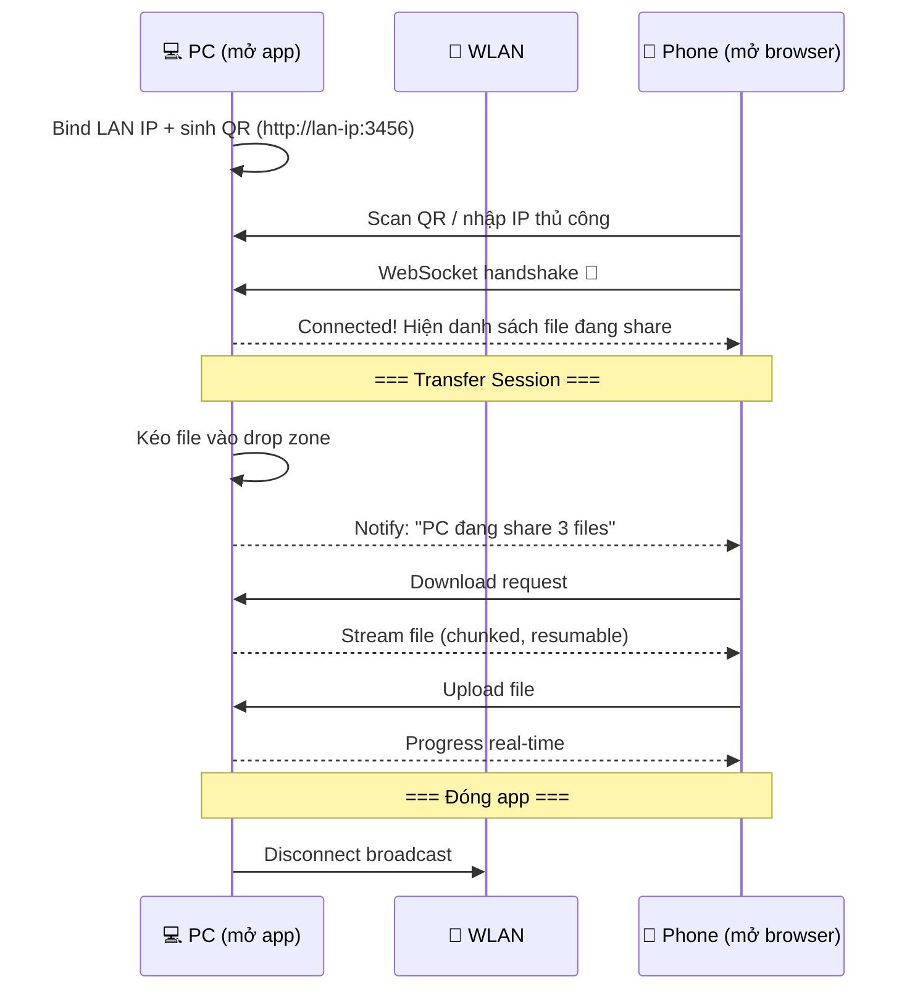
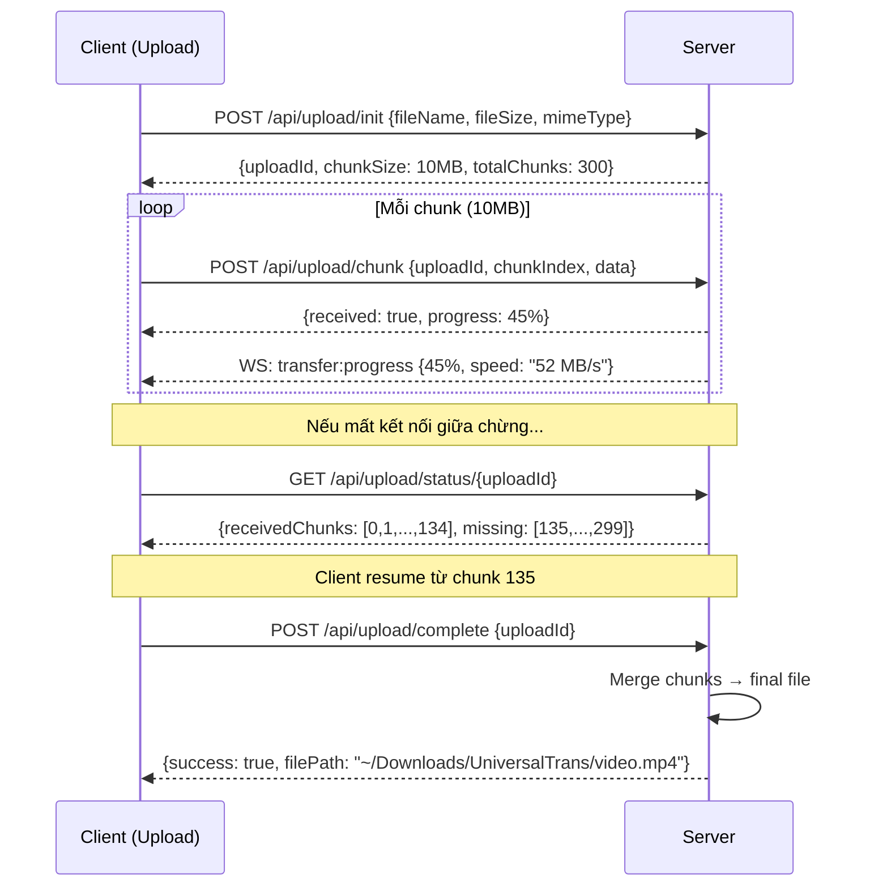

# UniversalTrans — AirDrop-style File Transfer qua WLAN

## Thay đổi từ feedback

| Yêu cầu          | Trước                | Sau                                                     |
| ---------------- | -------------------- | ------------------------------------------------------- |
| **Chia sẻ file** | Browse thư mục PC    | ✅ Kéo thả file vào app → staging area                  |
| **Kết nối**      | Server chạy liên tục | ✅ On-demand — mở app → auto-discover → transfer → đóng |
| **File lớn**     | Chưa xác định        | ✅ Chunked transfer + resume, hỗ trợ đến 7GB+           |
| **Mô hình**      | File server          | ✅ AirDrop-like point-to-point                          |

---

## Kiến trúc: On-demand P2P Hub



### Flow thực tế

**Trên PC (Windows/Linux):**

1. Chạy `universaltrans` (hoặc double-click shortcut)
2. Cửa sổ browser mở ra → hiển thị QR code + drop zone
3. Kéo file/folder vào drop zone → file sẵn sàng để share
4. Thấy thiết bị kết nối + nhận file upload
5. Đóng tab/terminal khi xong → server tự tắt

**Trên Mobile (Android/iPhone/iPad):**

1. Mở Chrome/Safari → nhập IP hoặc scan QR (lần đầu)
2. PWA đã cài → tap icon trên home screen (lần sau)
3. Auto-connect tới PC đang online
4. Thấy file PC đang share → tap download
5. Tap upload → chọn ảnh/video/file → gửi lên PC

---

## Proposed Changes

### Server Core

#### [NEW] [`package.json`](file:///c:/Users/tumin/OneDrive/Documents/UniversalTrans/package.json)

```
Dependencies:
  express, ws, multer, qrcode, archiver,
  mime-types, sharp (thumbnails), open (auto-open browser)
Scripts:
  "start": launch server + open browser
  "dev": launch with auto-reload (nodemon)
```

#### [NEW] [`src/server.js`](file:///c:/Users/tumin/OneDrive/Documents/UniversalTrans/src/server.js)

- **Ephemeral server**: Start khi chạy app, stop khi đóng
- **Bind LAN IP** mặc định, allow `127.0.0.1` cho test, cấm `0.0.0.0` prod
- **QR code generation** tại startup (kèm PIN nếu bật)
- **Auto-open browser** tới `http://<lan-ip>:3456`
- **Graceful shutdown**: cleanup staging + temp chunks khi Ctrl+C / SIGTERM

**REST API:**

| Endpoint                       | Method | Mô tả                                                                        |
| ------------------------------ | ------ | ---------------------------------------------------------------------------- |
| `/api/info`                    | GET    | Server info, QR data, device name                                            |
| `/api/shared`                  | GET    | Danh sách file đang share (staging area)                                     |
| `/api/share`                   | POST   | PC thêm file vào staging (kéo thả từ desktop)                                |
| `/api/share/:fileId`           | DELETE | Bỏ file khỏi staging (không xóa file gốc)                                    |
| `/api/download/:fileId`        | GET    | Stream file (Range → resume, 206). Video preview dùng trực tiếp endpoint này |
| `/api/upload`                  | POST   | Upload đơn <100MB (multer)                                                   |
| `/api/upload/init`             | POST   | Khởi tạo chunked upload (trả uploadId, chunkSize 10MB)                       |
| `/api/upload/chunk`            | POST   | Upload 1 chunk (uploadId, chunkIndex, chunk)                                 |
| `/api/upload/status/:uploadId` | GET    | Trạng thái chunks để resume                                                  |
| `/api/upload/complete`         | POST   | Merge chunks → uploadDir                                                     |
| `/api/thumbnail/:fileId`       | GET    | Thumbnail ảnh WebP 200x200, video → icon placeholder                         |
| `/api/auth`                    | POST   | Verify PIN → token (stub Phase 1, enforce Phase 2)                           |

**WebSocket Events:**

| Event                             | Direction     | Mô tả                                               |
| --------------------------------- | ------------- | --------------------------------------------------- |
| `device:join`                     | Server→Client | Thiết bị mới kết nối                                |
| `device:leave`                    | Server→Client | Thiết bị ngắt kết nối                               |
| `share:update`                    | Server→Client | Danh sách file share thay đổi                       |
| `transfer:progress`               | Server→Client | Chỉ cho upload. Download progress do client tự tính |
| `transfer:complete`               | Server→Client | Transfer hoàn tất                                   |
| `transfer:error`                  | Server→Client | Lỗi transfer                                        |
| `client:register` / `client:ping` | Client→Server | Đăng ký + heartbeat 30s                             |

#### [NEW] [`src/config.js`](file:///c:/Users/tumin/OneDrive/Documents/UniversalTrans/src/config.js)

- Chuẩn duy nhất theo TECHNICAL_SPEC §8.1: port 3456, uploadDir `~/Downloads/UniversalTrans`, tempDir `<app>/temp`, chunkSize 10MB, maxFileSize 10GB, maxConcurrent 5, maxDevices 20, expiry 1h, thumb 200px q80, pin null, autoOpenBrowser true
- Override qua `UTRANS_*` env + validation

#### [NEW] [`src/utils/` + `src/services/`](file:///c:/Users/tumin/OneDrive/Documents/UniversalTrans/src/services/chunked-upload.js)

- `utils/network.js`: `os.networkInterfaces()`, bỏ loopback/virtual Docker/VPN
- `utils/file-utils.js`: type detect (magic bytes, không chỉ extension) + sanitize + format size
- `utils/id-generator.js`: nanoid wrapper
- `services/chunked-upload.js`: hỗ trợ đến 10GB max (target 7GB), temp folder, merge, cleanup 1h, resume qua status, chặn duplicate chunk + race
- `services/thumbnail.js`: chỉ ảnh sharp WebP 200x200 q80, lazy + cache; video/file >100MB → icon, không ffmpeg MVP
- `services/share-manager.js`: Map in-memory, dual mode — browser upload staging + JSON paths chỉ CLI/Electron local

---

### Frontend — Universal PWA

#### [NEW] [`public/index.html`](file:///c:/Users/tumin/OneDrive/Documents/UniversalTrans/public/index.html)

- SPA responsive layout
- PWA manifest (Chrome + Safari compatible)
- `apple-mobile-web-app-capable` cho iOS fullscreen
- Google Fonts: Inter

#### [NEW] [`public/styles.css`](file:///c:/Users/tumin/OneDrive/Documents/UniversalTrans/public/styles.css)

**Design System:**

- **Theme**: Dark mode mặc định, glassmorphism cards
- **Colors**: Deep navy background (`#0a0e1a`), electric blue accent (`#3b82f6`), neon green success
- **Typography**: Inter font, clear hierarchy
- **Cards**: `backdrop-filter: blur()`, subtle borders, glow effects
- **Animations**:
  - File card hover: scale + glow
  - Drop zone: pulsing border animation khi drag-over
  - Progress bar: gradient shimmer
  - Device connect: slide-in notification
- **Responsive**:
  - Mobile: bottom action bar, full-width cards
  - Tablet: 2-column grid
  - Desktop: sidebar + main content
- **iOS**: `safe-area-inset` padding

#### [NEW] [`public/js/` modular](file:///c:/Users/tumin/OneDrive/Documents/UniversalTrans/public/js/app.js)

- Theo coding-standards: `app.js` (router hash #files/#upload/#transfers/#devices), `connection.js` (WS auto-reconnect backoff 1s→30s + heartbeat 30s), `file-browser.js` (grid/list, lazy thumb IntersectionObserver), `drop-zone.js` (PC share = upload content lên staging, không dùng absolute path; folder webkitdirectory + paste Ctrl+V), `transfer.js`, `ui.js`, `utils.js`

**Core Modules:**

1. **Connection Manager**
   - Auto-connect WebSocket tới server
   - Reconnect backoff 1s,2s,4s,8s,max 30s + heartbeat
   - Device info exchange (tên, OS, icon)

2. **Drop Zone** (PC view)
   - Drag & drop file từ desktop vào browser → upload content lên staging (browser không cho absolute path)
   - JSON `{paths:[]}` chỉ dành cho CLI/Electron local
   - File list management (add/remove)
   - Folder support (webkitdirectory, fallback file picker)
   - Paste from clipboard (Ctrl+V ảnh)

3. **File Browser** (Mobile view)
   - Grid view với thumbnails
   - List view cho chi tiết
   - File type badges (📷 ảnh, 🎬 video, 📦 APK)
   - Tap to preview (video dùng download Range trực tiếp), long-press to download

4. **Transfer Engine**
   - Small files (<100MB): single HTTP POST/GET
   - Large files (>=100MB): chunked upload (download luôn streaming + Range, không chunk)
   - Upload progress: WS server→client; download progress: client tự tính
   - Queue management: parallel transfers (max 5, khớp spec)
   - Resume on reconnect via status API
   - Speed indicator (MB/s, rolling 5s) + ETA

5. **Upload Zone** (Mobile view)
   - `<input type="file" multiple accept="image/*,video/*,.apk">`
   - Camera capture shortcut
   - Recent files quick-select

6. **Notifications**
   - Device connected/disconnected toasts
   - Transfer complete notifications
   - Error alerts với retry button

#### [NEW] [`public/manifest.json`](file:///c:/Users/tumin/OneDrive/Documents/UniversalTrans/public/manifest.json)

```json
{
  "name": "UniversalTrans",
  "short_name": "UTrans",
  "display": "standalone",
  "background_color": "#0a0e1a",
  "theme_color": "#3b82f6"
}
```

#### [NEW] [`public/sw.js`](file:///c:/Users/tumin/OneDrive/Documents/UniversalTrans/public/sw.js)

- Cache static assets (HTML, CSS, JS, fonts, icons)
- Network-first cho API calls

#### [NEW] [`public/icons/`](file:///c:/Users/tumin/OneDrive/Documents/UniversalTrans/public/icons/)

- App icons: 192x192, 512x512 (PWA requirement)
- Favicon

---

## Chunked Transfer Protocol (cho file đến 10GB max, target 7GB)



> [!IMPORTANT]
> **Tại sao chunked?** File 5-7GB không thể upload trong 1 request HTTP — browser sẽ OOM hoặc timeout. Chunk 10MB × 700 chunks = 7GB, mỗi chunk là 1 request riêng, resume được nếu mất mạng.

---

## Tính năng Phase 1 (MVP — Build ngay)

- [ ] Ephemeral server (bind LAN IP, allow localhost test, QR + manual IP, không UDP)
- [ ] Auto-detect LAN IP + QR code
- [ ] **Drop zone trên PC**: kéo thả → upload content lên staging (JSON paths chỉ CLI/Electron)
- [ ] **File list trên mobile**: xem file PC đang share, tap download (direct link, không blob >500MB iOS)
- [ ] **Upload từ mobile**: chọn file → gửi lên PC (<100MB đơn, >=100MB chunked)
- [ ] **Chunked transfer**: hỗ trợ đến 10GB max với resume
- [ ] Real-time progress: upload via WS, download client-side + speed/ETA
- [ ] Responsive UI (mobile + tablet + desktop)
- [ ] PWA installable cơ bản (manifest + SW network-first API; iOS Add to Home Screen thủ công, HTTPS self-signed optional)
- [ ] Image thumbnails (sharp, video → icon)
- [ ] Device online indicator + heartbeat 30s/timeout 90s

## Phase 2 (Polish)

- [ ] PIN protection (`POST /api/auth`, rate-limit 5/phút, lockout 5 phút)
- [ ] Video preview qua download Range (không endpoint riêng)
- [ ] Transfer history, Dark/Light toggle
- [ ] Clipboard sync
- [ ] Drag-drop trên iPadOS (fallback tap-upload)
- [ ] Folder share + zip download (dời từ MVP sang Phase 5 nếu quá tải)

---

## Verification Plan

### Automated

```bash
npm run dev
curl http://localhost:3456/api/info
# Upload test file
curl -X POST -F "file=@test.jpg" http://localhost:3456/api/upload
```

### Manual Cross-Platform

| Test Case                  | Thiết bị       | Expected                                        |
| -------------------------- | -------------- | ----------------------------------------------- |
| Kéo thả file vào drop zone | Windows PC     | File xuất hiện trong shared list                |
| Scan QR + download         | Android Chrome | File download thành công                        |
| Upload ảnh                 | iPhone Safari  | Ảnh xuất hiện trong ~/Downloads/UniversalTrans/ |
| Upload video 3GB           | Android Chrome | Chunked upload + progress + resume              |
| Đóng server + mở lại       | Windows PC     | Server stop/start clean                         |
| 2 devices đồng thời        | Android + iPad | Cả 2 thấy nhau + transfer song song             |

### Speed Target (khớp TECHNICAL_SPEC §5)

- Small <10MB: <3s (target <1s WiFi 6)
- 100MB: <10s (target <3s WiFi 6)
- 1GB: <45s (target <20s WiFi 6, >50MB/s)
- 5GB chunked: <5 phút (target <100s WiFi 6)
- Server RAM <256MB logic, CPU <30% sustained, max 5 concurrent / 20 devices
